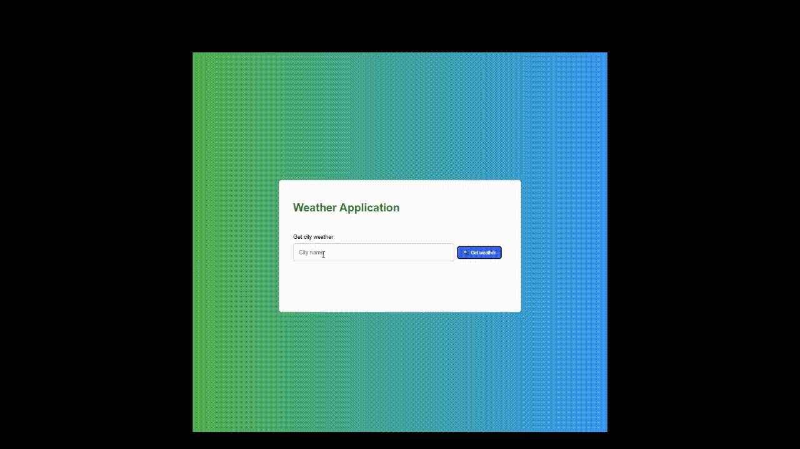

# 🌤️ Simple Weather App


This is a clean and simple weather application that fetches real-time weather data for any city you search.

---

## 🚀 Features

- **Search Functionality**: Get the current weather for a specific city.
- **Live Data**: Fetches weather, temperature, and a corresponding icon from the OpenWeatherMap API.
- **Dynamic Display**: Shows a dynamic icon and temperature based on the weather conditions.
- **Date Display**: Displays the current date in a clean format.
- **Responsive Design**: The layout adapts to different screen sizes.

---

## 📸 Demo

Here's a quick look at the app in action:



---

## 🛠️ Tecnologies Used

- **HTML5**
- **CSS3**
- **JavaScript (ES6+)**
- **jQuery**
- **OpenWeatherMap API**

---

## 📦 How to run

1. Clone the repository:

   ```bash
   git clone https://github.com/tiagogalvao7/weather-app.git
   ```

2. Replace apiKey in `app.js` 

3. Open `index.html` in your web browser.

